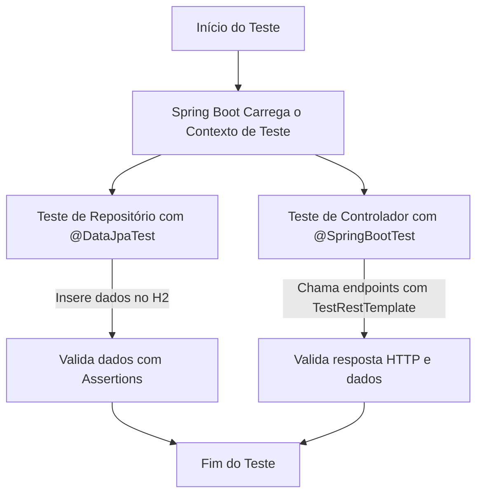

# 📦 Spring Integration Testing Demo

Este projeto demonstra **Testes de Integração** no Spring Boot usando **JPA**, **H2 Database** e **Spring Boot Test**.  
São abordados testes de repositórios e testes de endpoints REST.

---

## 🛠 Tecnologias Utilizadas
- Java 21
- Spring Boot 3
- Spring Data JPA
- H2 Database
- JUnit 5
- Spring Boot Test

---

## 📂 Estrutura do Projeto

```text

spring-integration-testing-demo/
├── src/
│ ├── main/
│ │ ├── java/com/example/springintegrationtestingdemo
│ │ │ ├── SpringIntegrationTestingDemoApplication.java
│ │ │ ├── entity/Product.java
│ │ │ ├── repository/ProductRepository.java
│ │ │ └── controller/ProductController.java
│ │ └── resources/application.properties
│ └── test/
│ ├── java/com/example/springintegrationtestingdemo
│ │ ├── repository/ProductRepositoryTest.java
│ │ ├── controller/ProductControllerTest.java
│ └── resources/application-test.properties
├── build.gradle.kts
└── README.md

```

---

## 🔍 Fluxo de Execução dos Testes



## 🚀 Como Executar

```bash

./gradlew test

```


